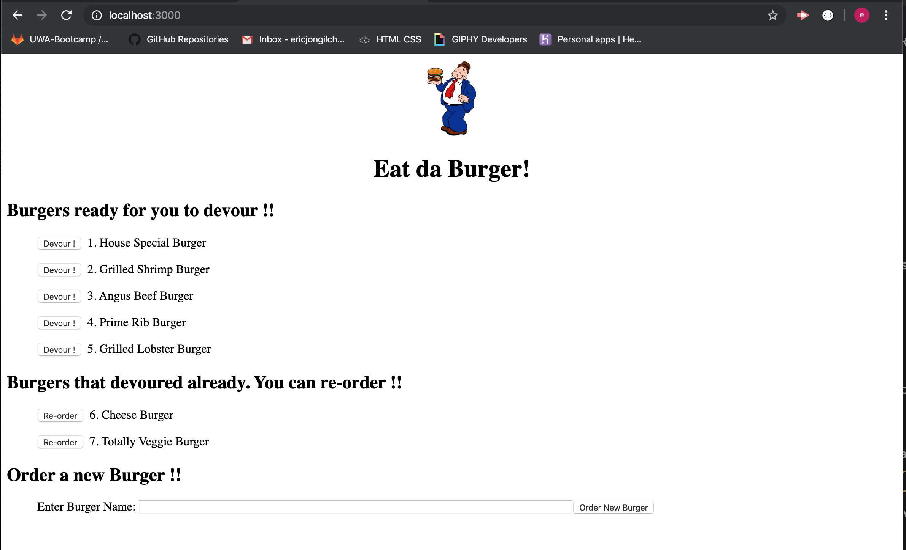
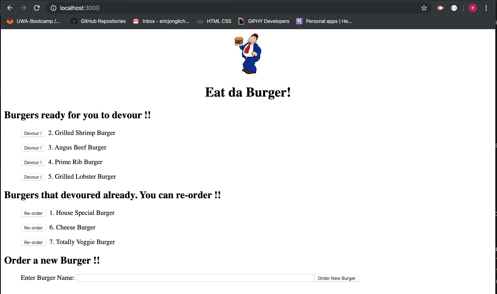
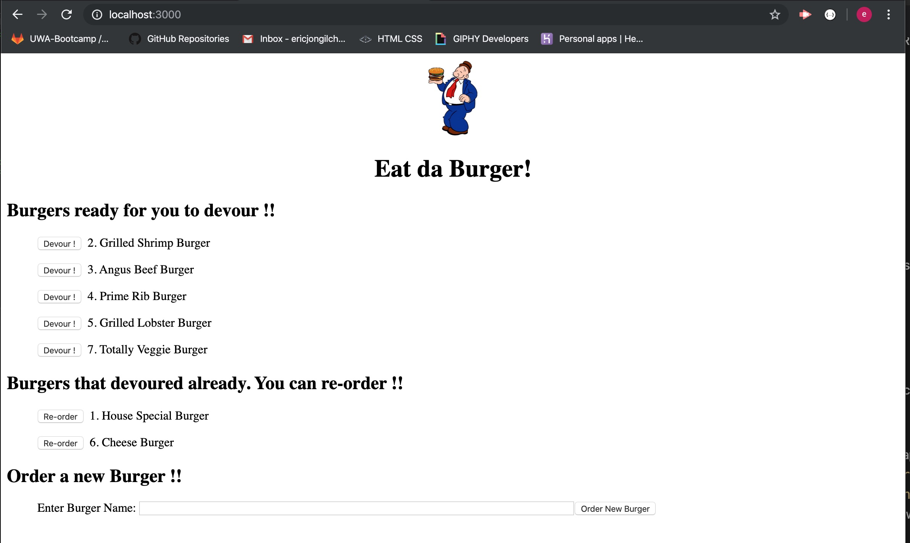

# burger
### Eat-Da-Burger

This app is going to add and update buger data in MySQL database using Node, Express, MySQL, Handlebars and ORM.

### Current progress

* Completed
  * GitHub repository
  * .gitignore file 
  * file directories
  * data file
  * npm init
  * npm installation packages
  * MVC structure
  * prepopulation of burger data using schema.sql and seeds.sql from command line
  * `devour` and `Re-Order` button function
  * app running screenshots (showing current progress)

* Further development
  * web browser reload needs to be done manually.
  * New burger addition to MySQL database and updating web browser is not completed yet.
  * deploy to heroku with the final version
  * add heroku deployed link in README.md file

* App running screenshots

Figure 1. Initial loading of the app. Burger names and ids are pre-populated with schema.sql and seeds.sql from command line.

Figure 2. When user clicked `devour` button of burger id 1. House Special Burger. The id and burger name moved to devoured list and its devoured status updated as true in MySQL database.

Figure 3. When use clicked `Re-Order` button of burger id 7.  Totally Veggie Burger. The id and burger name moved to ready for devoured list and its devoured status updated as false in MySQL database.

### Run app on Heroku
The link will be provided when the app is fully working and deployed.