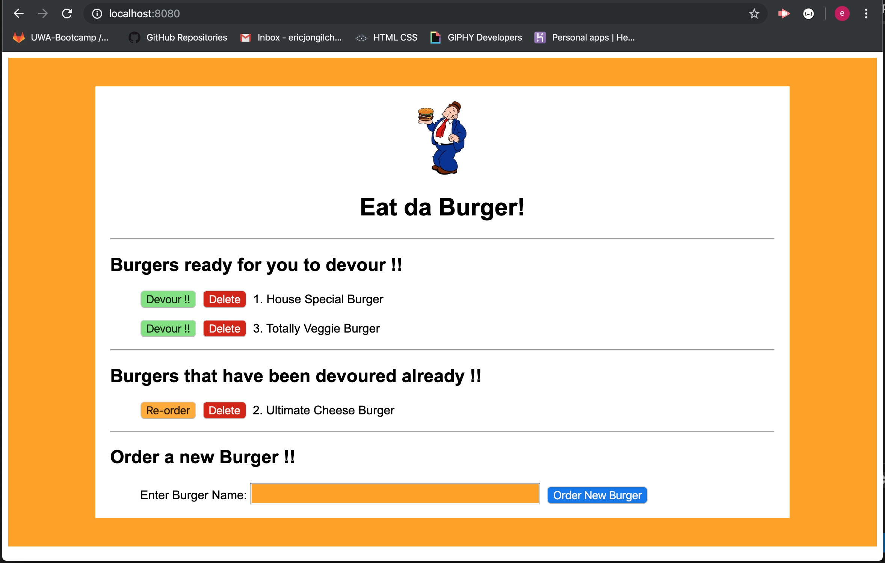
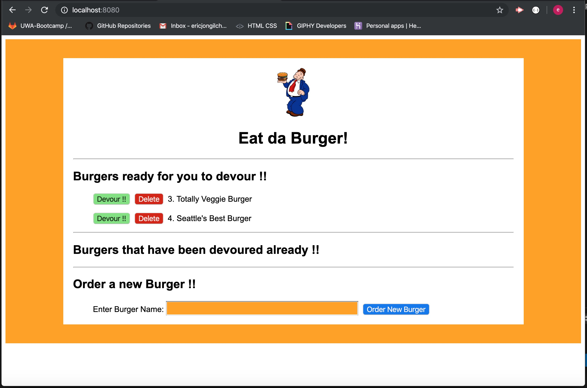

# burger
## Eat-Da-Burger

This app is going to add, update and delete burger data in `MySQL` database and displays results in the browser using `Node.js`, `Express.js`, `MySQL` and `Handlebars`.

* Completed
  * GitHub repository
  * file directories and files with MVC structure
  * npm init
  * npm packages installed
  * pre-population of burger data using `schema.sql` and `seeds.sql` from command line
  * Button functions including
    * `Devour !!`
    * `Re-Order`
    * `Delete`
    * `Order New Burger`
  * app running screenshots added to README.md
  * Deployed to Heroku

* Further development
  * Adding validation for checking duplicated burger name input. Currently the duplicated burger name can be added with different primary key (id).

### App running screenshots

Figure 1. Initial loading of the app. Burger names are pre-populated with `schema.sql` and `seeds.sql` from command line. The ids are auto-incremantally generated.

Figure 2. When user clicked `devour` button of burger id 2. Ultimate Cheese Burger. The id and burger name moved down to the devoured list, and its devoured status updated as true in MySQL database so that the user can re-order.

Figure 3. When user clicked `Re-Order` button of burger id 3. Totally Veggie Burger. The id and burger name moved up to ready for devoured list, and its devoured status updated as false in MySQL database so that the user can devour.

Figure 4. User entered new burger name "Seattle's Best Burger" in the textbox and about to click `Order New Burger` button.

Figure 5. After user clicked `Order New Burger` button, the new burger "Seattle's Best Burger" is stored in the ready for devoured list with newly generated id 4. Its devoured status is set as false so that the user can devour.

Figure 6. When user clicked `Delete` button of burger id 1. House Special Burger. The id and burger name has been deleted from ready for devoured list.

Figure 7. `Delete` button also works for the burger listed in the already devoured list. "Ultimate Cheese Burger" of id 2 has been deleted after click the `Delete` button.

Figure 8. Alert popped up when the user clicked `Order New Burger` button without entering new burger name. User can resume using the app after click `OK` in the alert.

### [Run app on Heroku](https://aqueous-tundra-65909.herokuapp.com/)